# juc基本使用

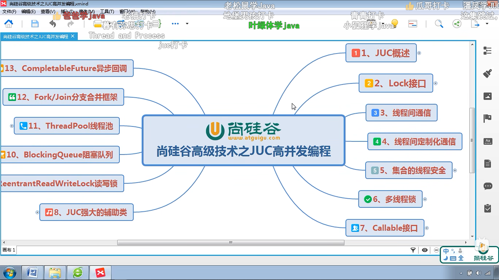

‍

‍

‍

一、JUC概述

1.JUC

**JUC是java.util.concurrent工具包的简称，** **处理线程的工具包**

‍

‍

**2.进程和线程的相关概念**

进程与线程：

进程：指在系统中正在运行的一个应用程序；程序一旦运行就是进程；**进程一一资源分配的最小单位**。  
线程：系统分配处理器时间资源的基本单元，或者说进程之内独立执行的一个单元执行流。**线程——程序执行的最小单位**。

‍

**线程状态：** 

**新建 就绪 阻塞 等待 超时等待 终结**

NEW **（新建）** 、RUNNABLE（准备就绪，**准备、就绪**）、BLOCKED **（阻塞）** 、WAITING（不见不散，**等待**）、TIMED_WAITING（过时不候，**超时等待**）、TERMINATED **（终结）** 

‍

**wait与sleep区别：** 

(1)sleep是**Thread的静态方法**，**wait**是**Object 的方法**，任何对象实例都能调用。  
(2)**sleep不会释放锁，它也不需要占用锁**。**wait会释放锁**，但**调用它的前提是当前线程占有锁**(即**代码要在synchronized中**)。  
(3)它们**都可以被interrupted方法中断**。

**sleep说白了就是任何线程都能用，而wait只能有锁的线程用**

‍

并发和并行：

**并发：** **同一时刻多个线程在访问同一个资源，多个线程对一个点。**   
例子:春运抢票 电商秒杀....

**并行：** **多项工作一起执行，之后再汇总。**   
例子:泡方便面，电水壶烧水，一边撕调料倒入桶中。

‍

‍

管程：管程对象**相当于锁**

**锁本身是用来保持同步的一种机制，** **保证同一时间只能有一个线程访问资源**

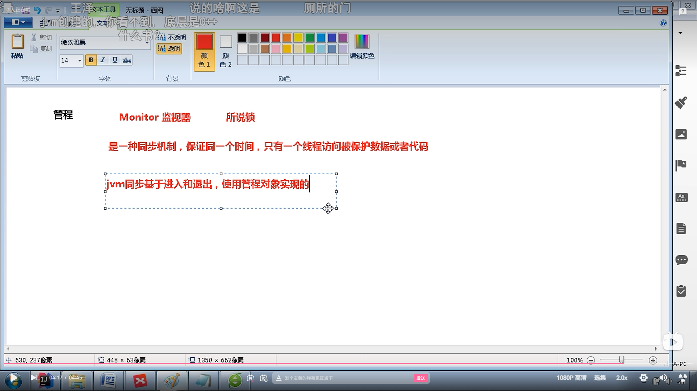

‍

‍

用户线程和守护线程：

**用户线程：自定义线程**

**守护线程：垃圾回收等**，**自定义线程转为守护的话使用setDaemon方法，参数为true即可**

**用户线程结束，jvm生命周期也结束了，守护线程的生命周期和jvm一样**

**只要有非守护线程在运行，那么程序就不会结束**

**守护线程随着主线程的结束而自动终止**

‍

‍

‍

二、lock接口

1.synchronized关键字

作用范围：

1.修饰一个**代码块**，被修饰的代码块称为**同步语句块**，其作用的范围是大括号{}括起来的代码，**作用的对象是调用这个代码块的对象**；

2.修饰一个**方法**，被修饰的方法称为**同步方法**，其作用的范围是整个方法，**作用的对象是调用这个方法的对象**;

3.修改一个**静态的方法**，其作用的范围是**整个静态方法**，**作用的对象是这个类的所有对象**；

4.修改一个**类**，其作用的范围是 **synchronized后面括号括起来的部分**，**作用主的对象是这个类的所有对象**。

‍

‍

**lock接口：可重入锁**

实现类：**ReentrantLock、ReentrantReadWriteLock.ReadLock、ReentrantReadWriteLock.WriteLock**

**ReentrantLock：可重入锁，也是递归锁**，**好比进了自己家的门，在去别的房间就不需要钥匙了**

新建可重入锁：`private final ReentrantLock lock = new ReentrantLock();`

‍

**lock与synchronized区别：** 

1.**Lock不是Java语言内置的，synchronized是Java语言的关键字**，因此是内置特性。**Lock是一个类，通过这个类可以实现同步访问；** 

2.**采用 synchronized不需要用户去手动释放锁**，当 synchronized方法或者synchronized 代码块执行完之后，系统会自动让线程释放对锁的占用；而**Lock则必须要用户去手动释放锁**，如果没有主动释放锁，就有可能导致出现**死锁现象**。

‍

‍

多线程的编程步骤：

第一步 创建资源类，在资源类创建属性和操作方法

第二步 创建多个线程，调用资源类的操作方法

‍

‍

‍

五、集合的线程安全

1.ArrayList集合线程不安全演示

解决方案——Vector（JDK1.0的时候的解决方案）

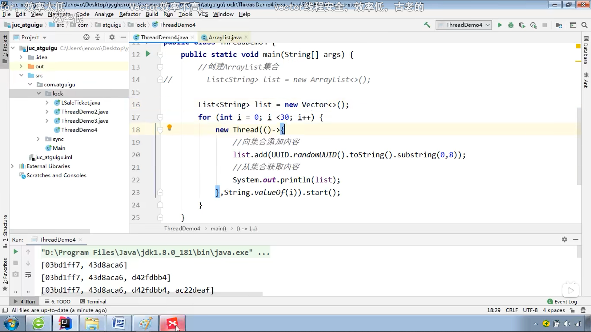

‍

解决方案——Collections

​`List<String> list = Collections.synchronizedList(new ArrayList<>());`

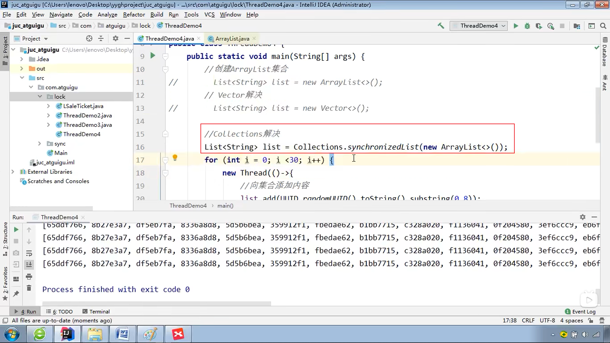

‍

‍

解决方案——**CopyOnWriteArrayList类**

**写时复制技术**

**并发读，独立写**，**写的时候复制内容到新空间，修改之后再返回赋值引用**

**写时复制整个过程都是lock加锁的**

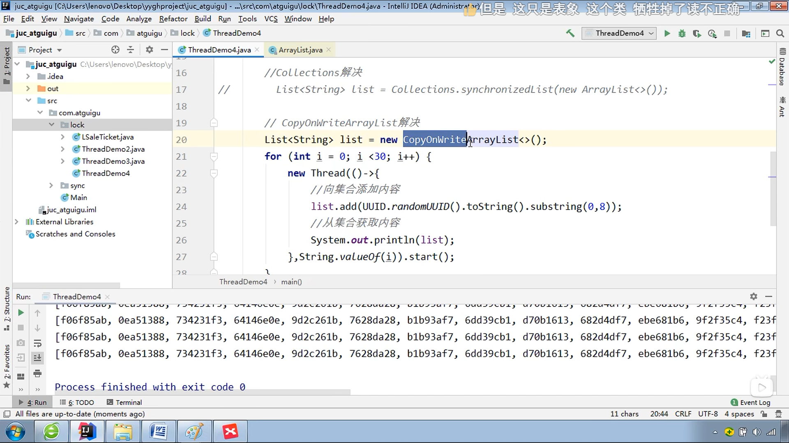

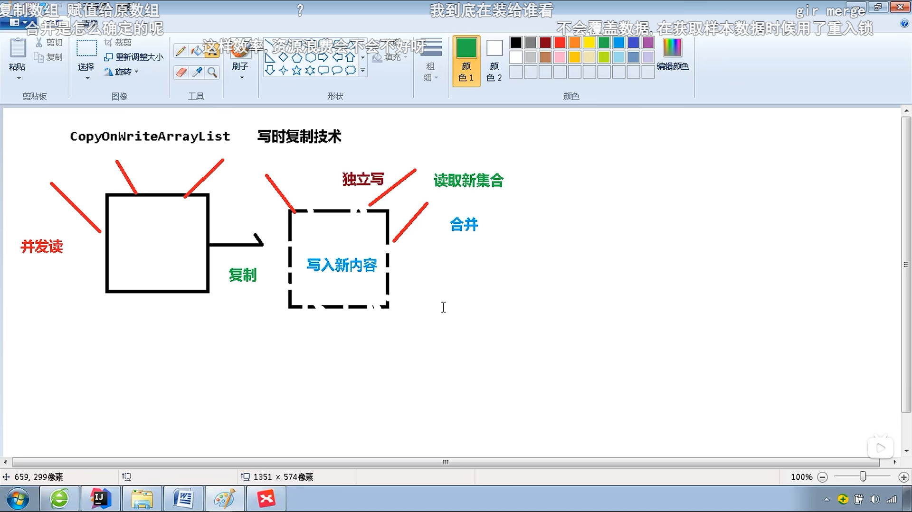

‍

‍

2.hashset线程不安全问题

解决方案：**CopyOnWriteArraySet类**

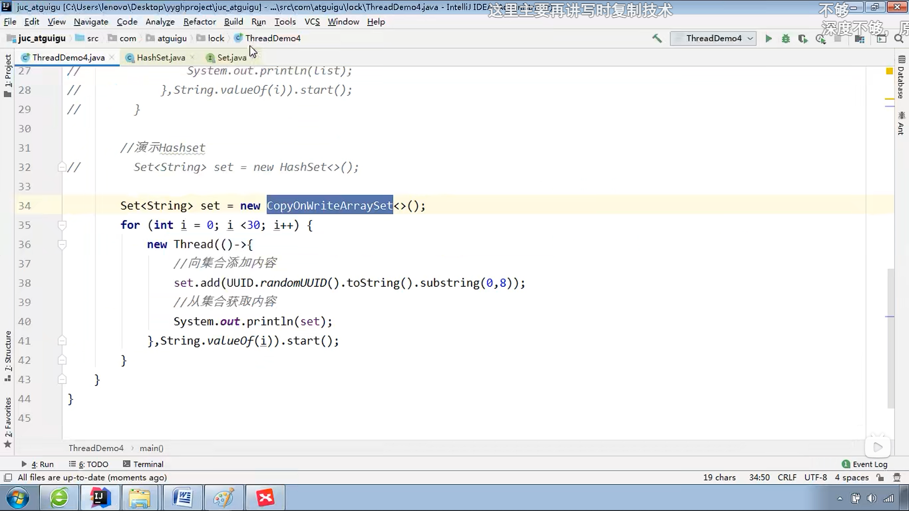

‍

‍

3.hashmap线程不安全问题

解决方案：**ConcurrentHashMap类**

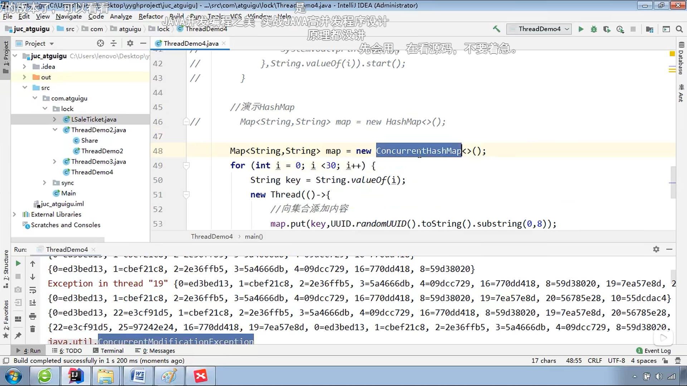

‍

‍

‍

六、多线程锁

1.synchronized关键字

synchronized关键字：**看用的是否是同一把锁，以及锁的范围**

**用synchronized时，两个对象不同时锁就不好约束相互线程，当对象一样时，一个线程占用锁，那么另一个线程也会等待浪费时间**

**非静态同步方法锁的是this，静态同步方法锁的是类本身的class实例**

1、2：**锁加在方法上，锁的是当前调用对象**

3：**方法没加锁**

4：**方法加锁，但是锁的不是同一个对象**

5、6：**静态方法加锁，锁的是CLASS实例**

7、8：**静态方法和非静态方法加锁，锁的不是同一个对象**

**synchronized对象锁，就是看对象是不是同一个 是的话谁在前面先拿到锁 谁就先执行里面的内容**

**synchronized实现同步的基础：** **Java中的每一个对象都可以作为锁。** 

具体表现为以下3种形式。

1.对于普通同步方法，锁是当前实例对象。

2.对于静态同步方法，锁是当前类的class对象。

3.对于同步方法块，锁是Synchonized括号里配置的对象

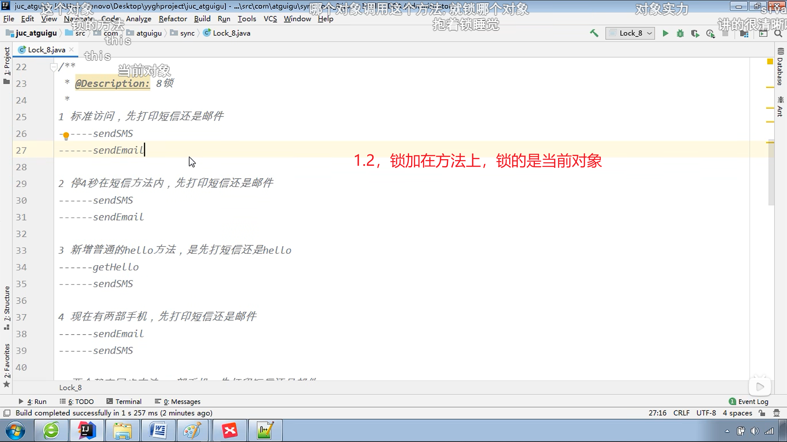

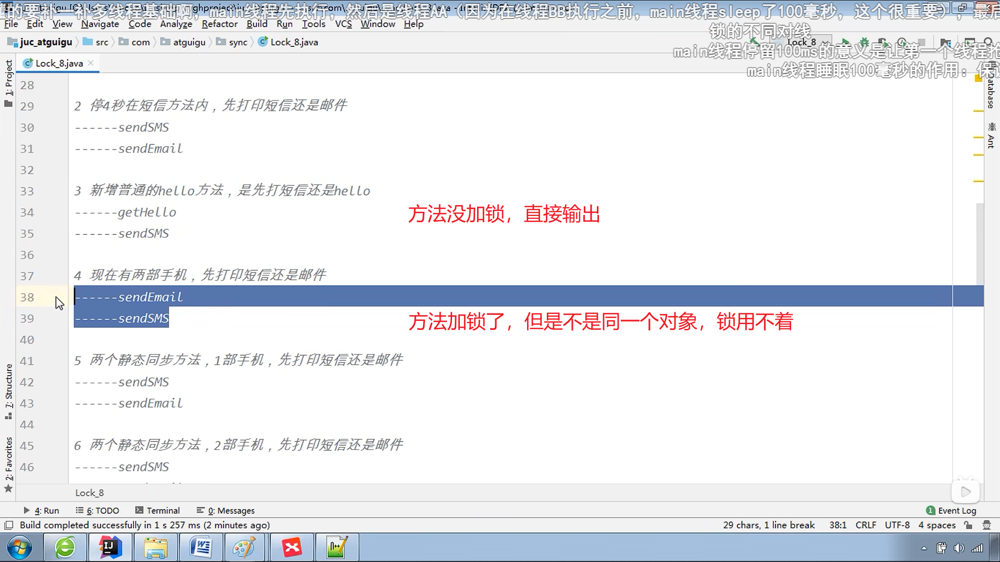

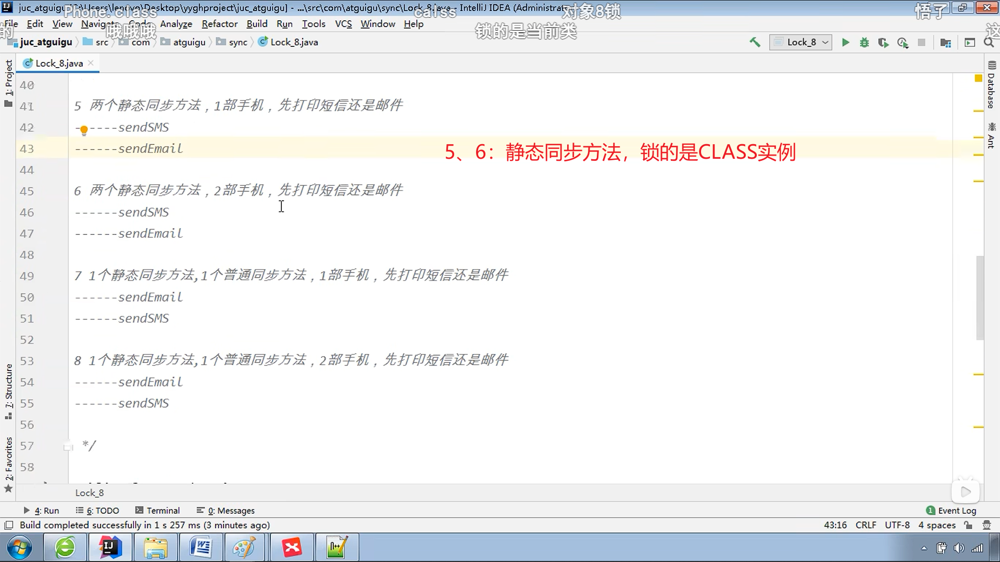

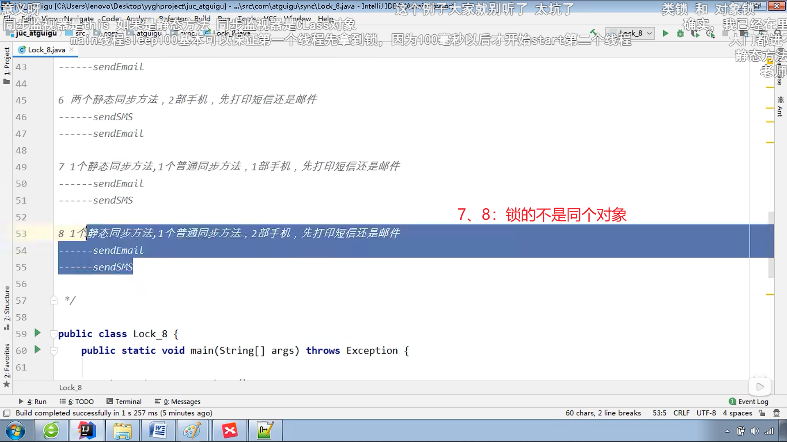

‍

‍

4.死锁

死锁：**两个或者两个以上进程在执行过程中，因为争夺资源而造成一种互相等待的现象，如果没有外力干涉，他们无法再执行下去**

死锁原因：

1.系统资源不足；

2.进程运行推进顺序不合适；

3.资源分配不当

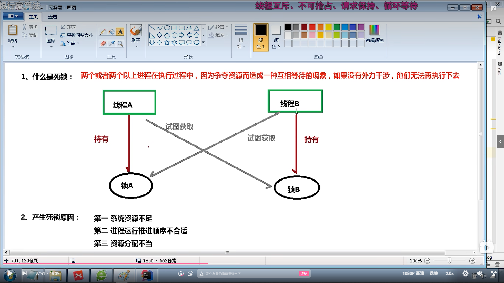

‍

‍

死锁的验证：

1.`jps`			类似于linux	ps -ef

2.`jstack`		jvm自带堆栈跟踪工具

‍

‍

‍

七、callable接口

1.callable接口和runnable接口的区别

区别：

1.是否有**返回值**

2.是否抛出**异常**（**callable接口若计算不出结果则抛出异常**）

3.**实现方法名称不同**，**一个run方法，一个call方法**

**实现类FutureTask**

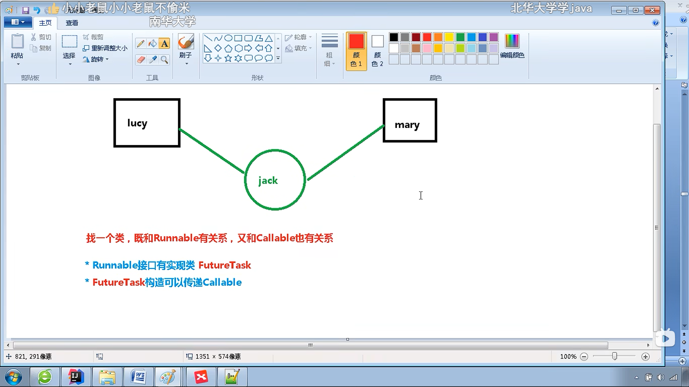

‍

‍

2.FutureTask实现类

FutureTask未来任务

原理：**单独给计算较大逻辑较大的方法开启单独线程，完成之后需要结果的话就get**

**线程的执行和最后的get是分开的两步**

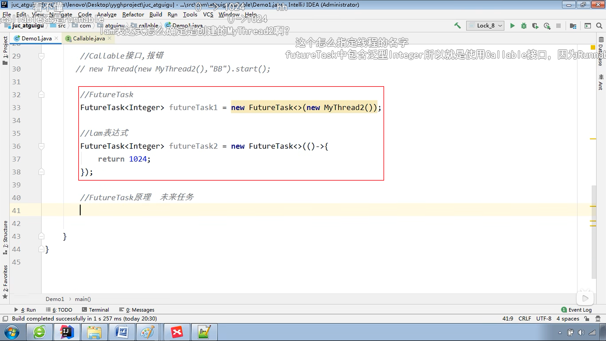

‍

‍

3.创建线程

**这里只有2个实现，一个是FutureTask实现了Runnable，一个是lambda匿名实现了Callable**

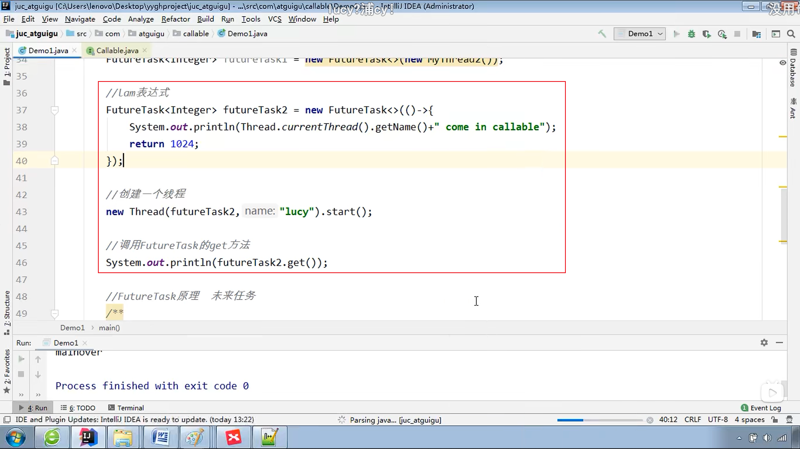

‍

‍

‍

八、JUC强大辅助类

1.减少计数——countdownlatch

CountDownLatch类**可以设置一个计数器**，然后通过**countDown 方法**来进行**减1**的操作，使用**await方法**等待计数器不大于0，然后**继续执行await方法之后的语句**。

原理：

CountDownLatch**主要有两个方法**，当**一个或多个线程调用await方法时，这些线程会阻塞**

其它**线程调用countDown方法会将计数器减1**(调用countDown方法的线程**不会阻塞**)

当**计数器的值变为0**时，因**await方法阻塞的线程会被唤醒，继续执行**。

举例：**我们用迅雷同同时下载5部电影，等到5个全部下载完成功弹出资源全部下载完毕**

创建代码：`CountDownLatchcountDownLatch = newCountDownLatch(6);`

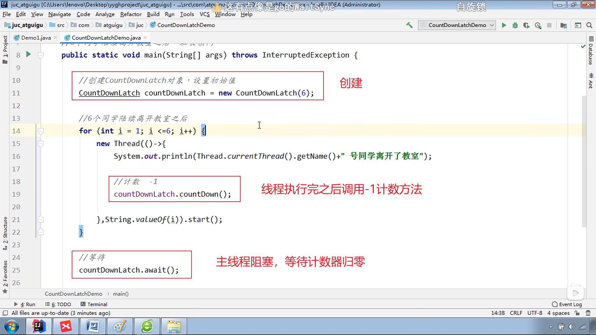

‍

‍

2.循环栅栏——cyclicbarrier

CyclicBarrier：**循环阻塞**，在使用中CyclicBarrier 的构造方法**第一个参数是目标障碍数**，每次**执行CyclicBarrier一次障碍数会加一**，如果**达到了目标障碍数**，才会**执行cyclicBarrier.await()之后的语句**。**可以将CyclicBarrier理解为加1操作**。

举例：**你和朋友出去玩，等所有人到了再一起出发去目的地**

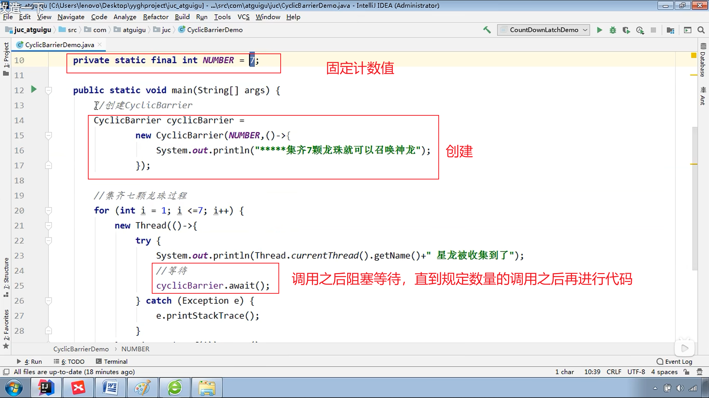

‍

‍

3.信号灯——Semaphore

Semaphore：Semaphore的构造方法中传入的**第一个参数是最大信号量(可以看成最大线程池)** ，每个**信号量初始化为一个最多只能分发一个许可证**。使用**acquire方法获得许可证，release方法释放许可**。

例子：

1.PV 操作

**2.抢车位，6辆汽车3个停车位**

**线程池是池化技术，减少生成和销毁线程的开销。这里是解决同步问题，是线程间资源访问问题。** 

创建代码：`Semaphore semaphore = new Semaphore( permits: 3);`

**设置成1的话就变成了可重入锁**

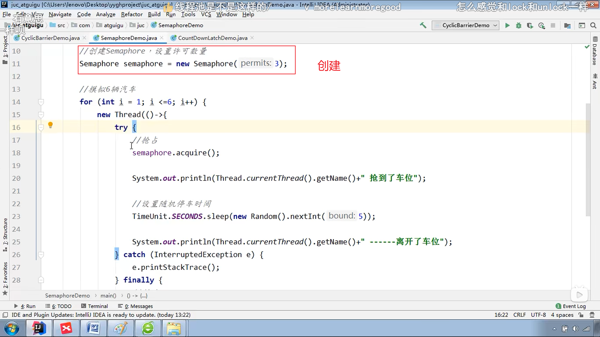

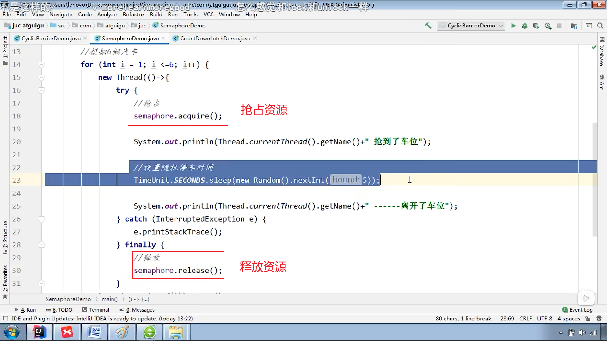

‍

‍

‍

十、阻塞队列（BlockingQueue）

1.阻塞队列概述

阻塞队列：顾名思义，首先它是一个队列，通过一个**共享的队列**，可以**使得数据由队列的一端输入，从另外一端输出**

**放满阻塞，取空阻塞**

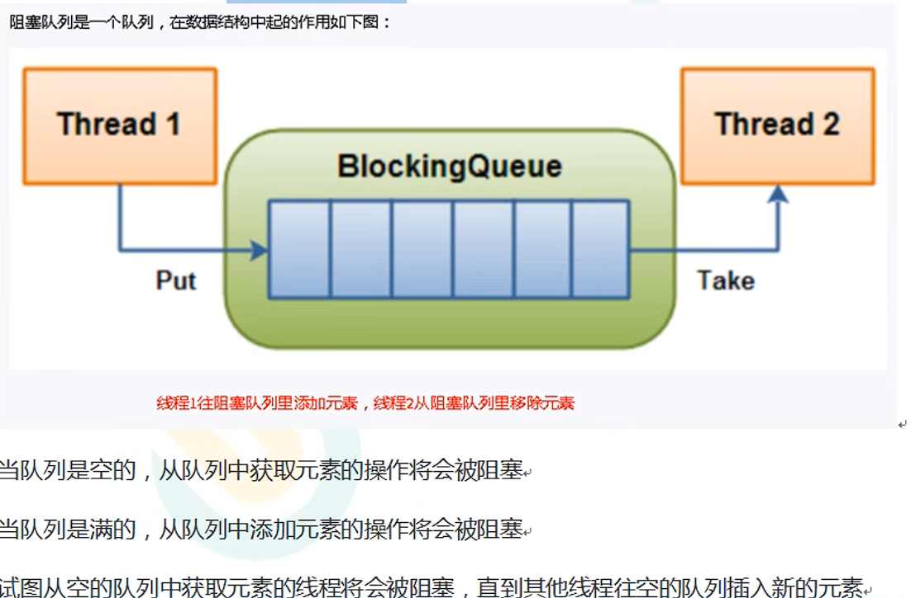

‍

‍

2.阻塞队列的架构

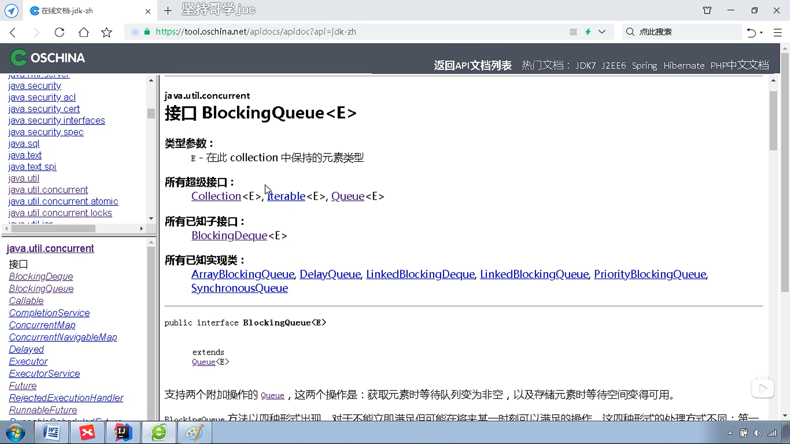

‍

‍

3.阻塞队列的分类

ArrayBlockingQueue **（常用）** ：**基于数组的阻塞队列**，**由数组结构组成的有界阻塞队列**。

LinkedBlockingQueue **（常用）** ：**基于链表的阻塞队列，** **由链表结构组成的有界(但大小默认值为integer.MAX_VALUE)阻塞队列。** 

DelayQueue：使用**优先级队列**实现的**延迟****无界**阻塞队列。

PriorityBlockingQueue：**支持优先级排序**的**无界**阻塞队列。

SynchronousQueue：**不存储元素的阻塞队列，** **也即单个元素的队列。** **每一个put操作必须等待take操作，否则不能添加元素。** 

LinkedTransferQueue：由**链表**组成的**无界**阻塞队列。

LinkedBlockingDeque：由**链表**组成的**双向阻塞队列。** 

‍

‍

核心方法：

抛出异常：add、remove、element

**特殊值：offer、poll、peek**

**阻塞：put、take**

超时：offer、poll

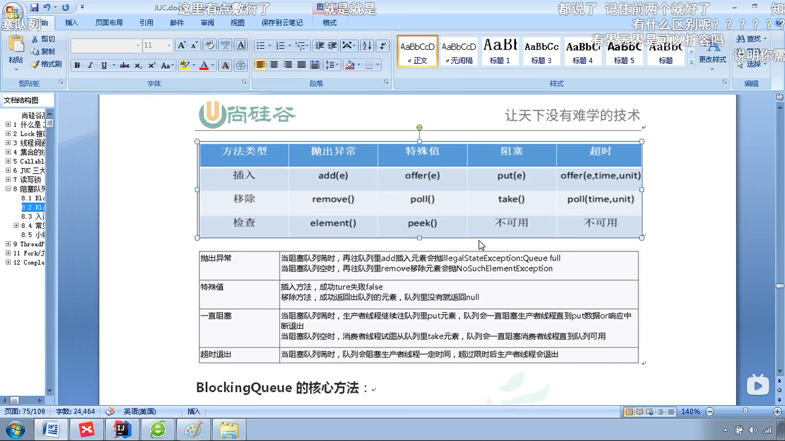

‍

‍

核心方法演示：

add和remove：

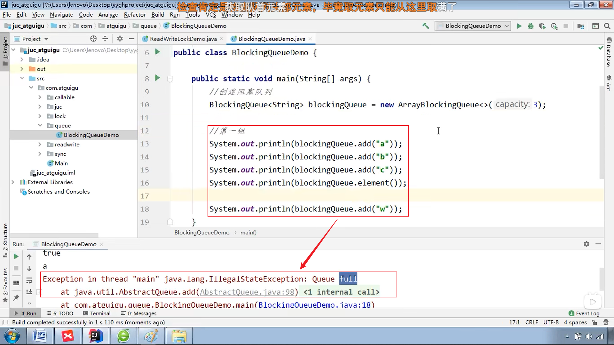

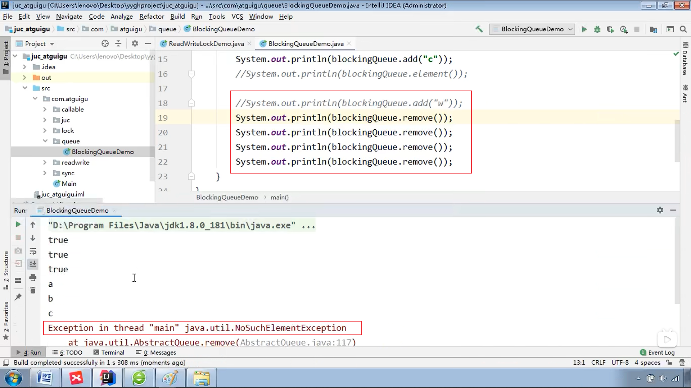

‍

offer和poll：

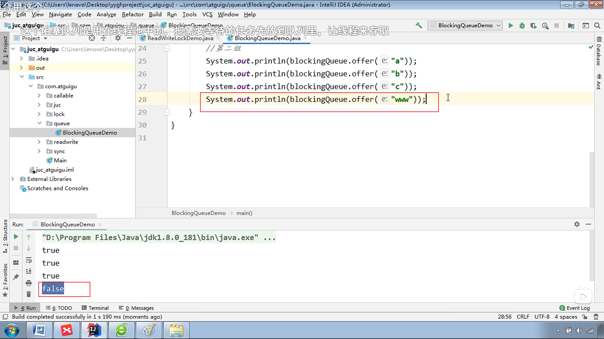

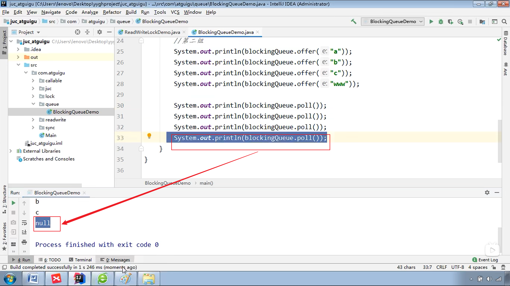

‍

put和take：

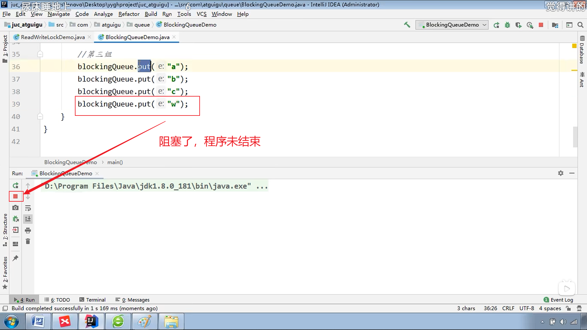

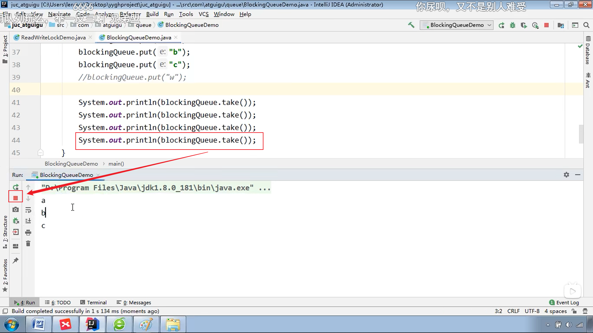

‍

超时offer：

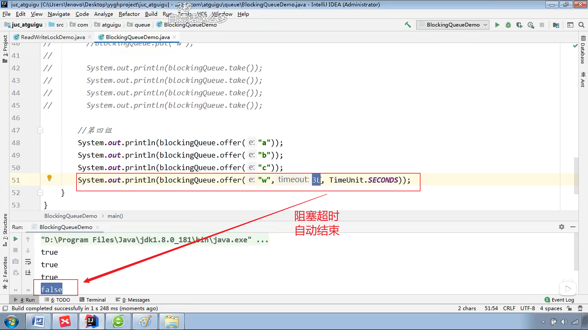

‍

‍

‍

十一、线程池（ThreadPool）

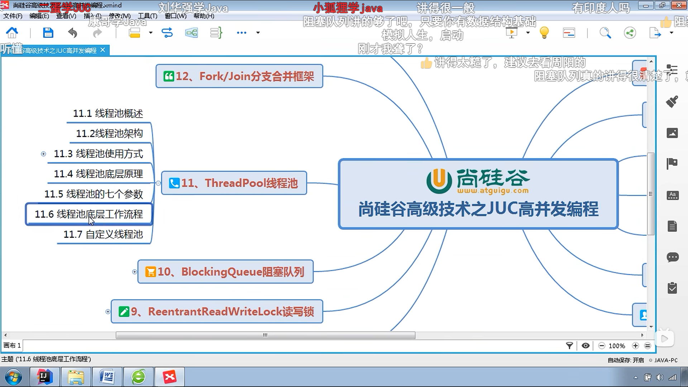

‍

‍

1.线程池概述

线程池：**一种线程使用模式**。线程过多会带来调度开销，进而影响缓存局部性和整体性能。而线程池**维护着多个线程，等待着监督管理者分配可并发执行的任务**。这避免了在处理短时间任务时创建与销毁线程的代价。线程池不仅能够保证内核的充分利用，还能防止过分调度。

特点：

1.降低资源消耗

2.提高响应速度

3.提高线程可管理性

‍

‍

2.线程池架构

**Java 中的线程池是通过Executor 框架实现的，** **该框架中用到了Executor，ExecutorsExecutorService, ThreadPoolExecutor 这几个类**

**Executors是工具类**

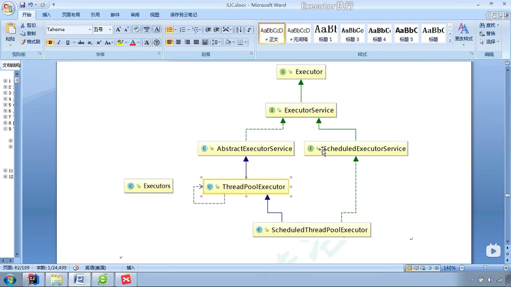

‍

‍

3.线程池使用方式

一池n线程：`Executors.newFixedThreadPool(int)`

**一池一线程**（**一个任务一个任务执行**）：`Executors.newSingleThreadExecutor()`

**一池一线程，可扩容** **（线程池根据需求创建线程，可扩容，遇强则强）** ：`Executors.newCachedThreadPool()`

**线程池不建议用Executors创建【见alibaba Java开发手册-并发处理】** 

**shutdown是关闭池子，关闭不是立即就关了，会等任务全部结束了才关闭**

**扩容是int最大值，这玩意不能用 容易oom**

底层：**三个都是new一个ThreadPoolExecutor，实现线程池创建**

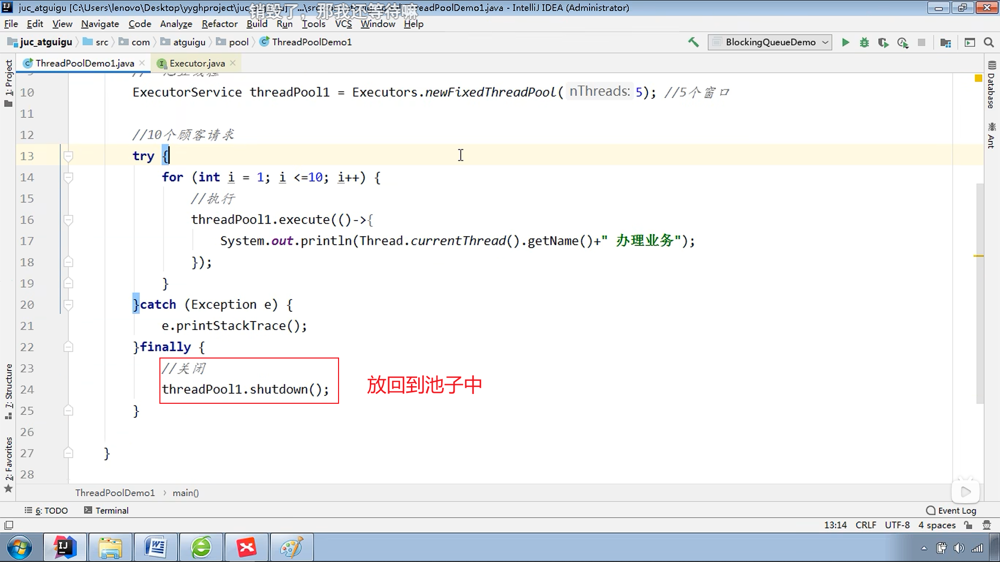

‍

‍

4.线程池7个参数

**阻塞队列不会满的，因为是Linked阻塞队列，无边界**

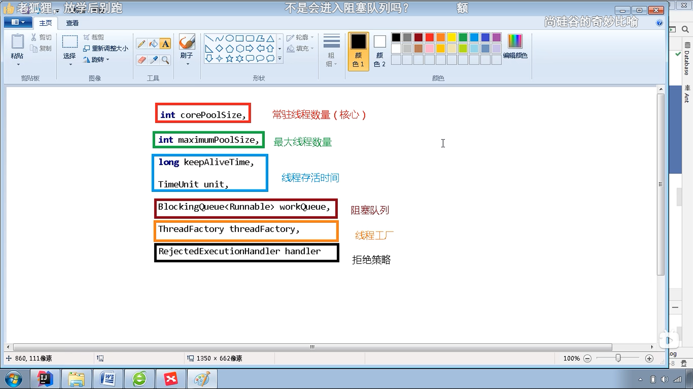
