# 1.JVM的位置及生命周期

‍

‍

‍

一、JVM的位置

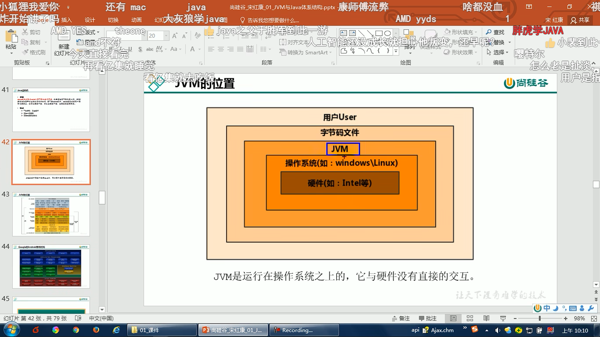

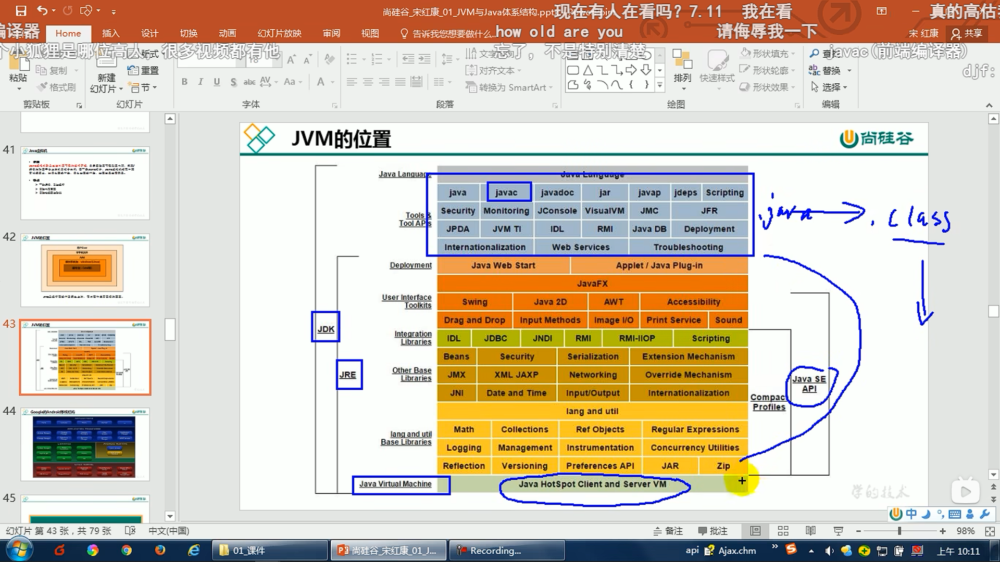

‍

‍

google的安卓系统结构：

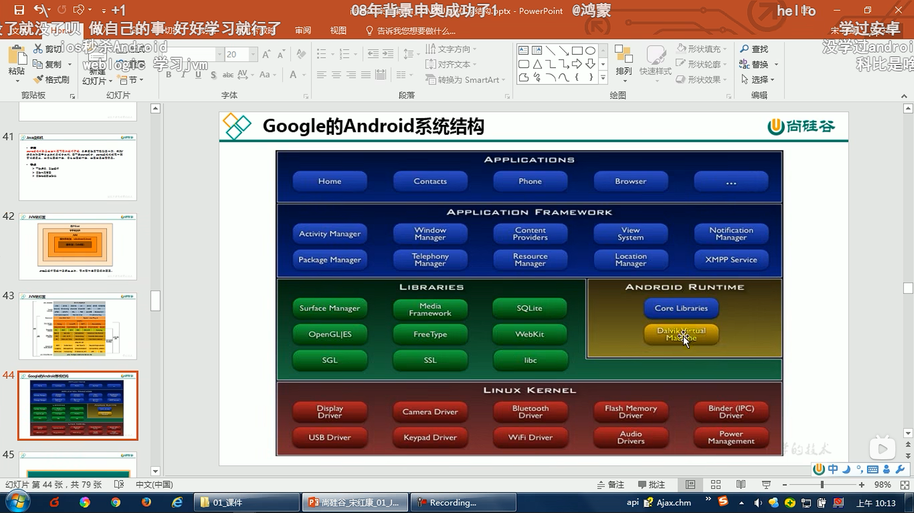

‍

‍

‍

二、JVM的整体结构

**前端编译器是将java代码编译成jvm可以看懂的class文件，而jit怎是将class文件解释成机器能够直接执行的机器码。** 

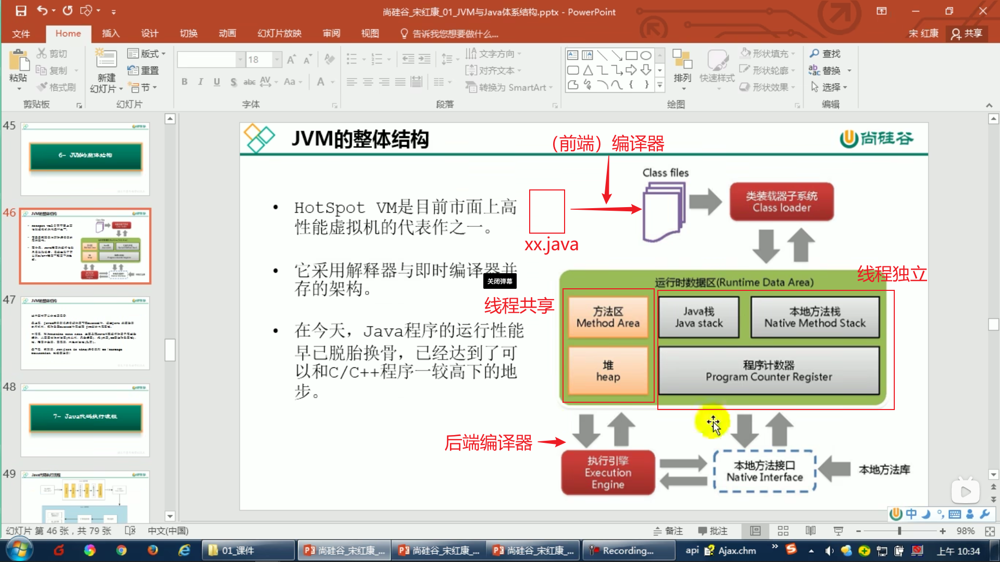

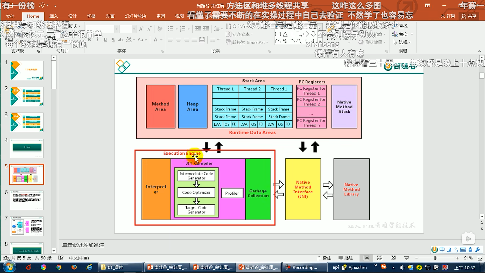

‍

‍

‍

三、java代码的执行流程

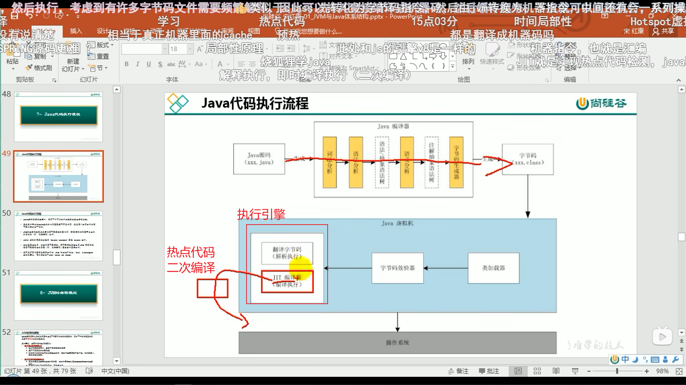

‍

‍

‍

四、JVM的架构模型

**基于栈的指令集架构：** **不需要硬件支持，零地址指令，指令集小**

**基于寄存器的指令集架构：** **需要硬件支持，一二三地址指令为主，花费更少**

**由于跨平台性的设计，Java的指令都是根据栈来设计的。** 不同平台CPU架构不同，所以不能设计为基于寄存器的。**优点是跨平台，指令集小，编译器容易实现**，**缺点是性能下降，实现同样的功能需要更多的指令**

栈：**跨平台性、指令集小、指令多；执行性能比寄存器差**

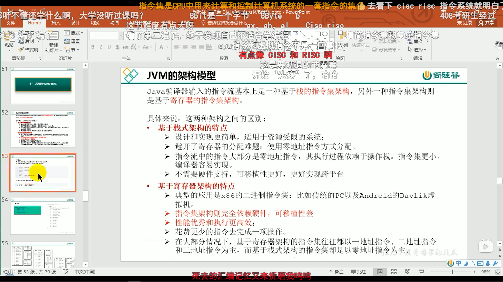

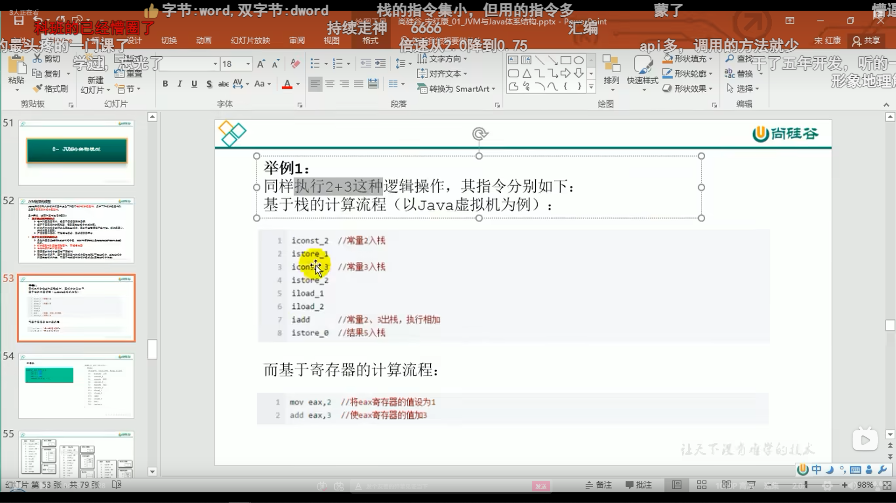

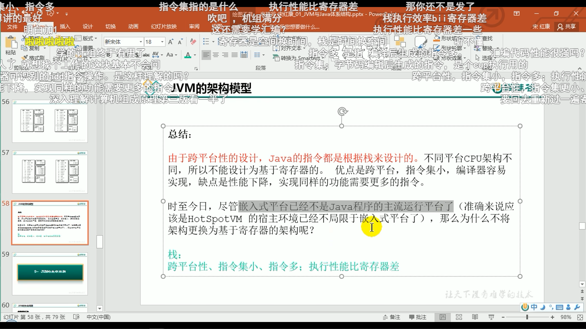

‍

‍

‍

五、JVM的生命周期

虚拟机的**启动**：**Java虚拟机的启动是通过引导类加载器(bootstrap class loader)创建一个初始类(initial class)来完成**的，**这个类是由虚拟机的具体实现指定的**。 **（双亲委派模型）** 

虚拟机的**执行**：**一个运行中的Java虚拟机有着一个清晰的任务：执行Java程序**。**程序开始执行时他才运行，程序结束时他就停止**。**执行一个所谓的Java程序的时候，真真正正在执行的是一个叫做Java虚拟机的进程**。

虚拟机的**退出**：几种情况：

1.程序**正常执行结束**

2.程序在执行过程中遇到了**异常或错误而异常终止**

3.由于**操作系统出现错误**而导致Java虚拟机进程终止

4.某线程**调用Runtime类或System类的exit方法**，或 **Runtime类的halt方法**，并且**Java安全管理器也允许这次exit或halt操作**。

5.除此之外，JNI ( Java Native Interface)规范描述了**用JNIInvocation API来加载或卸Java虚拟机时，Java虚拟机的退出**情况。

**正常结束：寿终正寝；异常结束：生病挂了；操作系统：被kill了；自己调用exit：自杀**

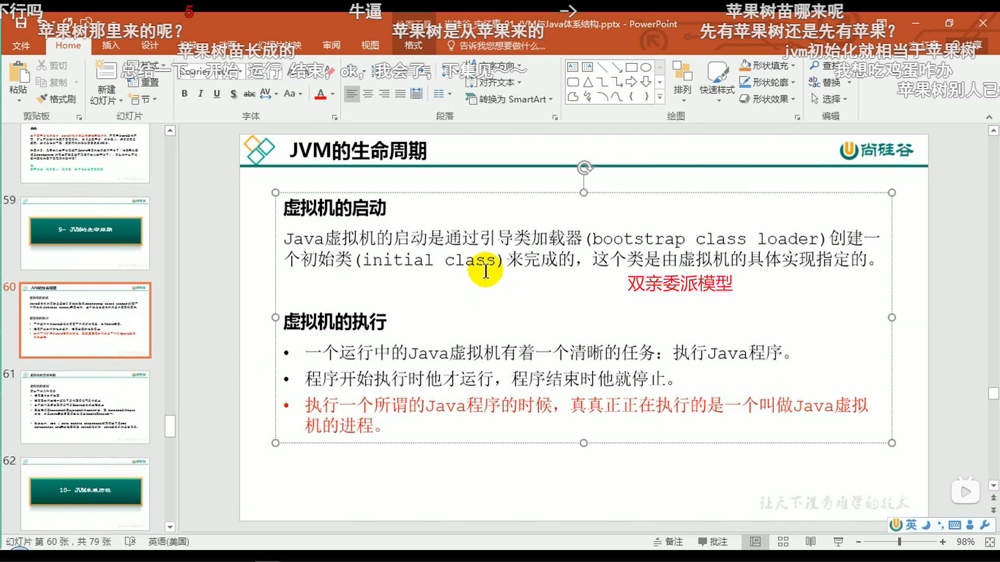

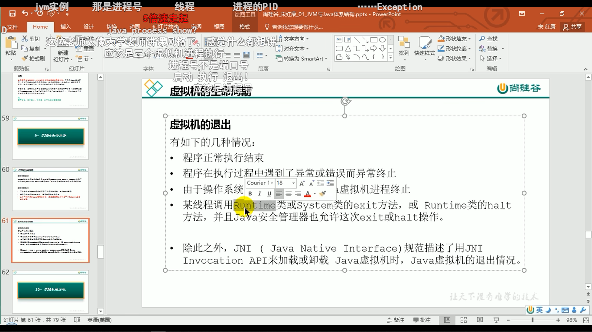
