# 14.垃圾回收概述

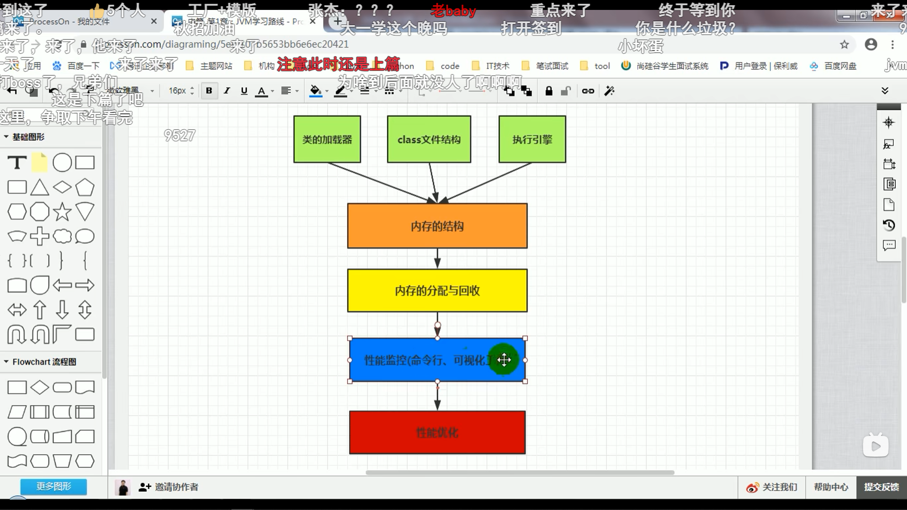

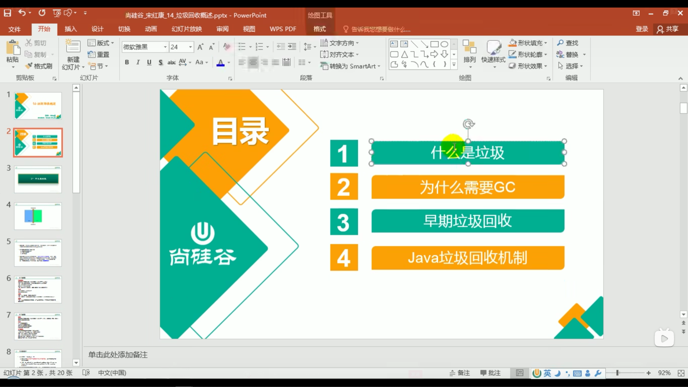

‍

‍

‍

一、什么是垃圾

三个经典问题：

**1.哪些内存需要回收?**

**2.什么时候回收?**

**3.如何回收?**

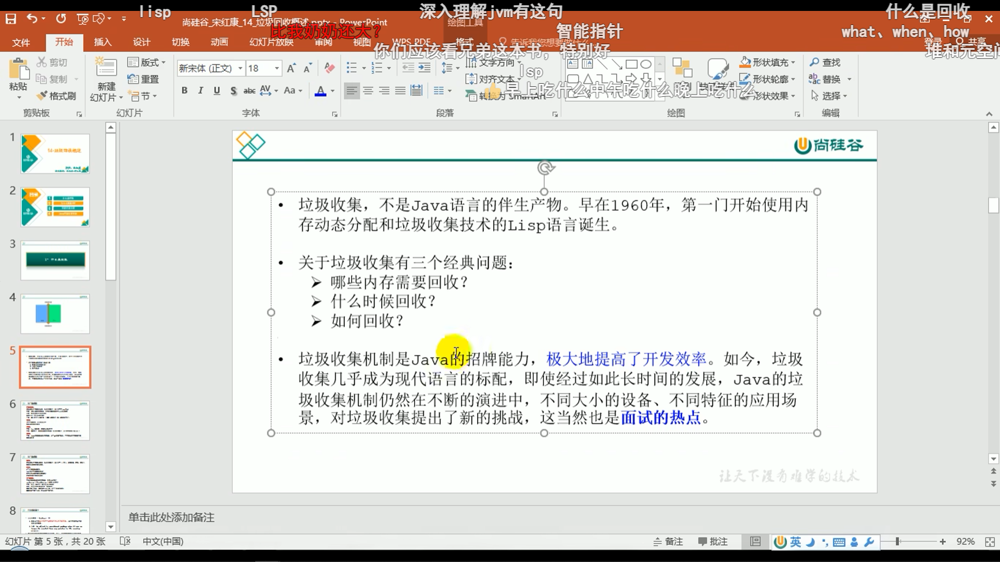

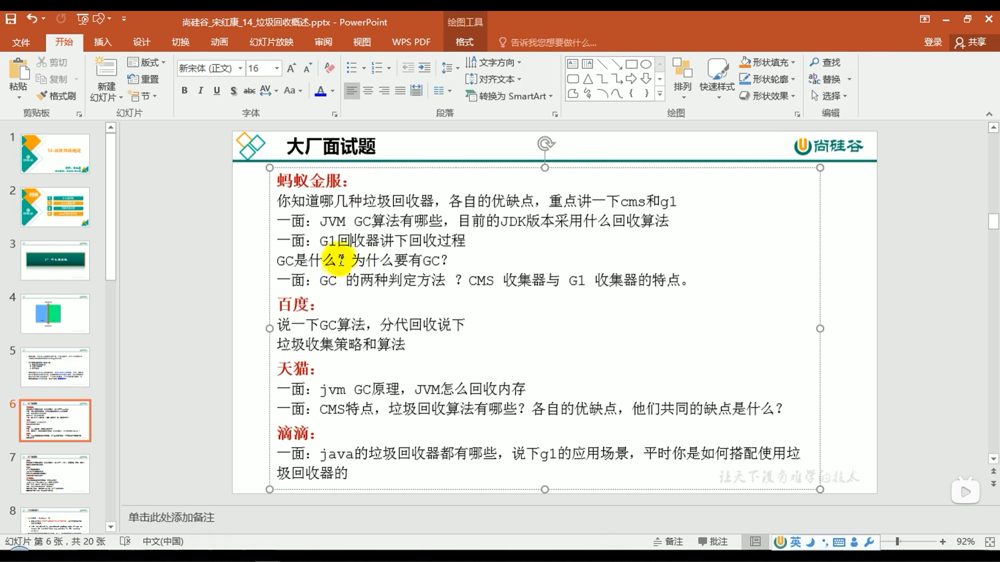

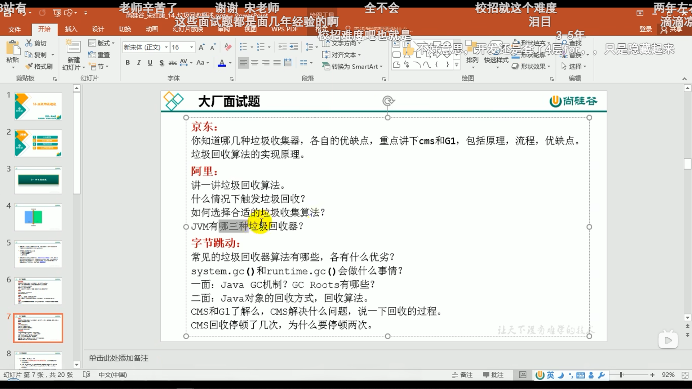

‍

‍

1.什么是垃圾

**垃圾是指在运行程序中没有任何指针指向的对象**，**这个对象就是需要被回收的垃圾。** 

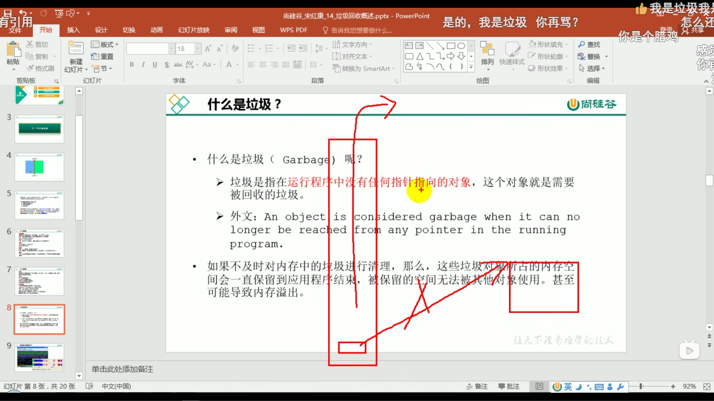

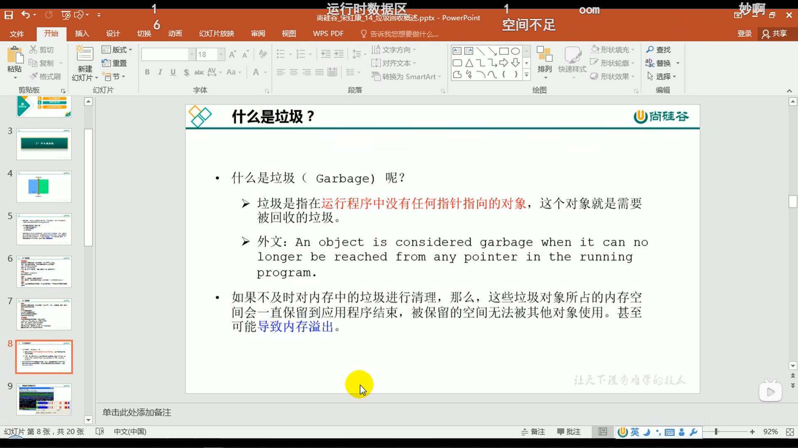

‍

‍

2.为什么需要GC

**内存清理；碎片整理；保证应用程序的正常进行**

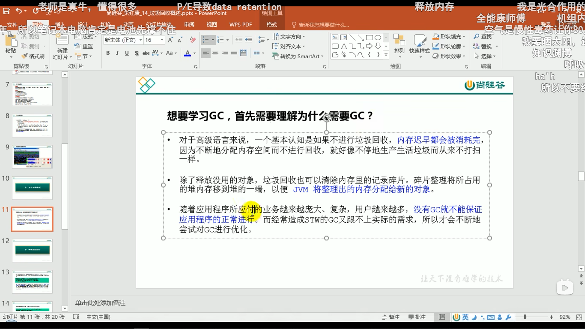

‍

‍

‍

二、早期垃圾回收

**早期，要手动new和手动delete清理，不清理会导致内存泄漏**

**内存泄漏问题：** **对象在程序运行期间无法被回收** **（对象没使用了，但是还有引用指向，清理不了）**  **。** 

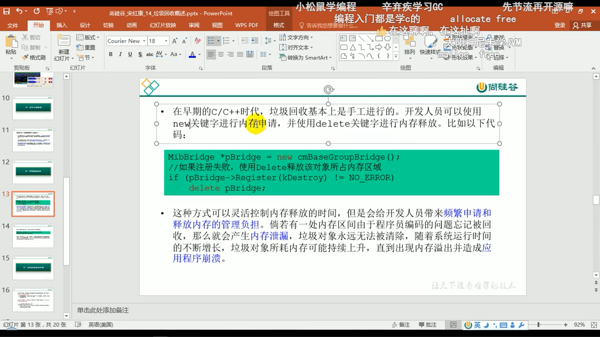

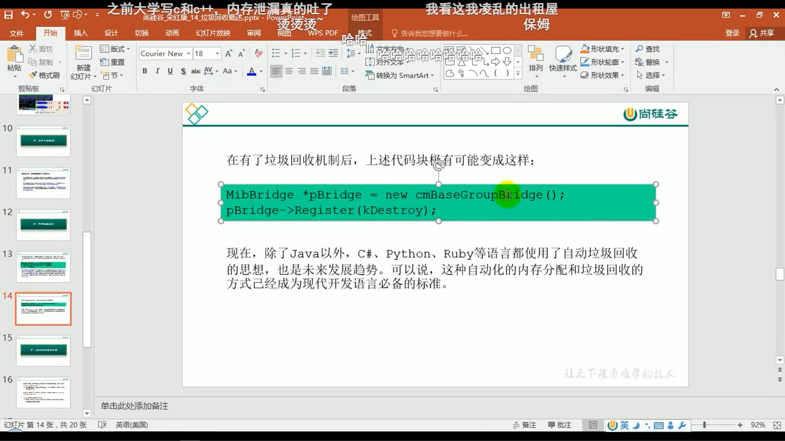

‍

‍

‍

三、Java垃圾回收机制

**实施必要的监控和调节**

**java堆是垃圾收集器的工作重点**

次数上讲：

**频繁收集年轻区（Young区）**

**较少收集老年区（Old区）**

**基本不动永久区 / 元空间（Perm区）**

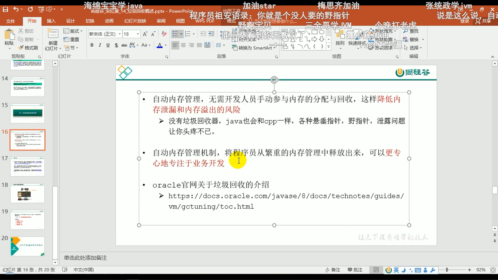

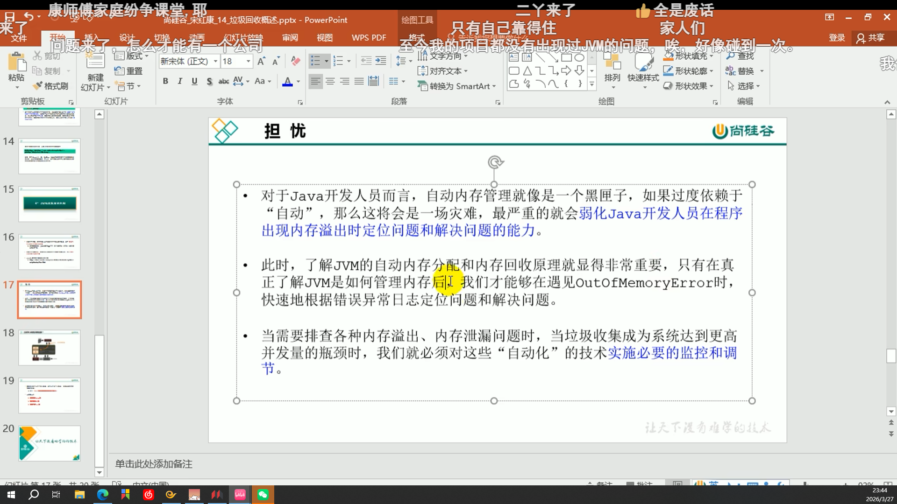

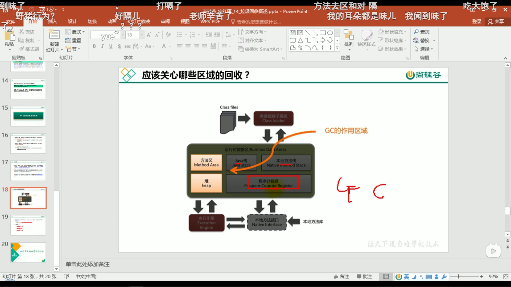

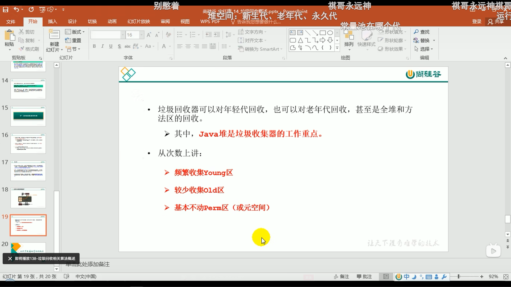

‍
