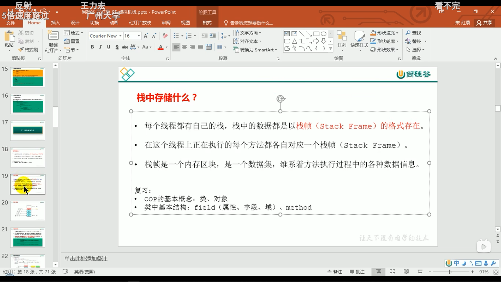
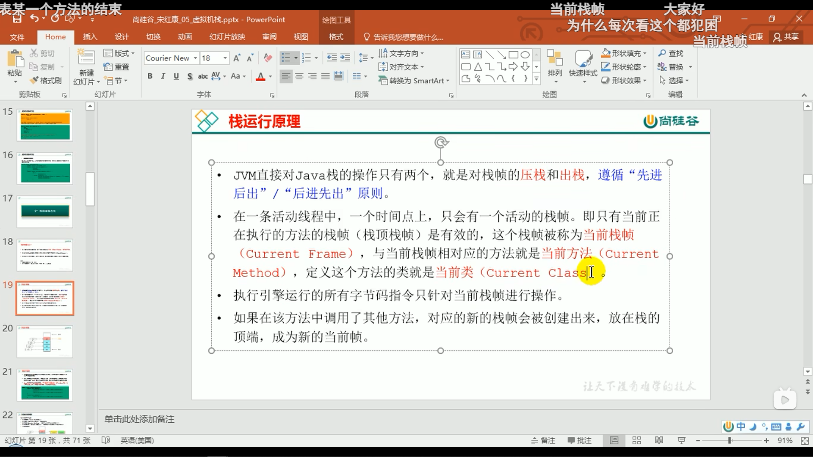
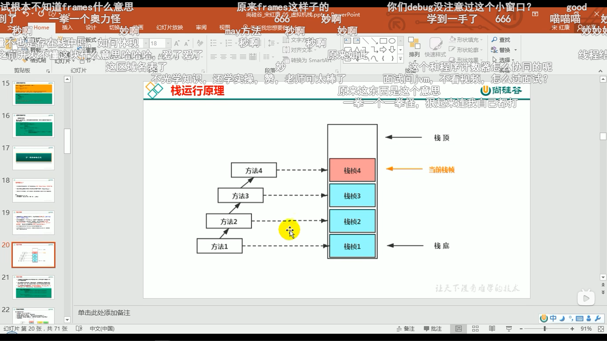
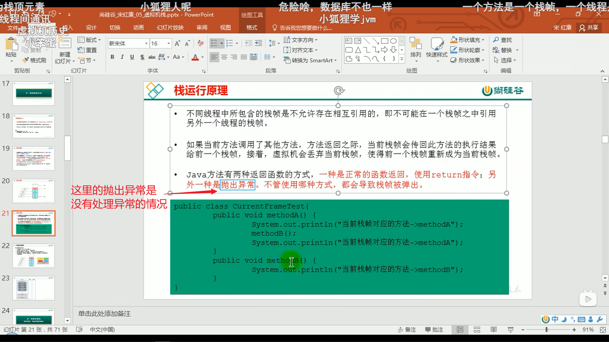
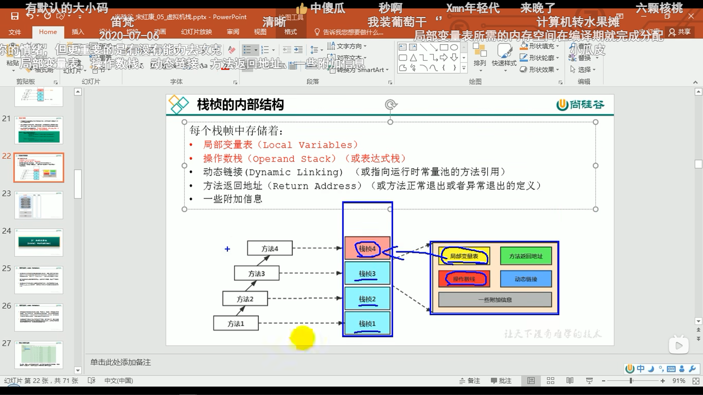
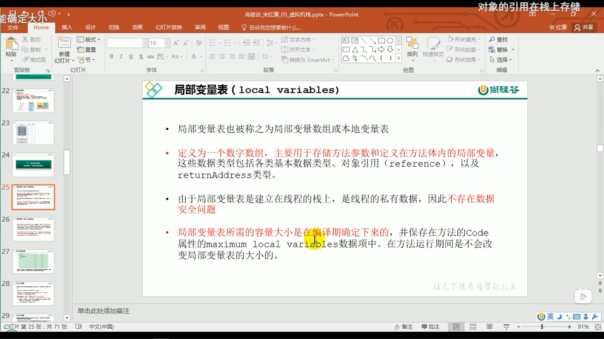
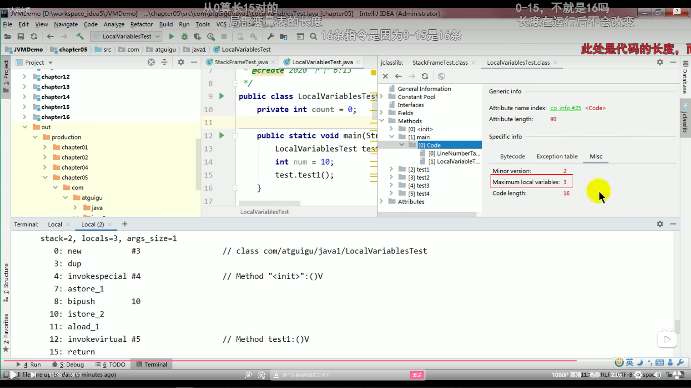
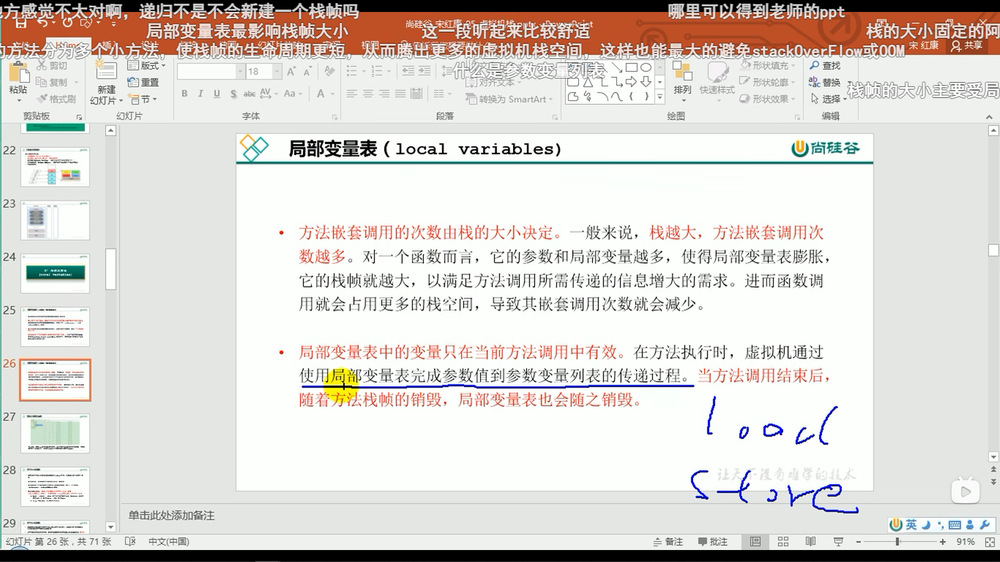

# 5.虚拟机栈

‍

‍

‍

二、栈的存储单位

1.栈的存储结构

栈的存储：

**每个线程都有自己的栈**，**栈中的数据都是以栈帧(StackFrame)的格式存在**

在这个线程上正在执行的**每个方法都各自对应一个栈帧**(Stack Frame)。

**栈帧是一个内存区块，是一个数据集**，维系着方法执行过程中的各种数据信息。

**方法和栈帧是一一对应的关系，一个方法的执行对应着一个栈帧的入栈，一个方法的执行结束，此栈帧就会出栈。** 

‍

‍

2.栈的运行原理

**JVM对JAVA栈的两个操作：** **对栈帧压栈和出栈**（**先进后出原则**）

在一条活动线程中，**一个时间点上，只会有一个活动的栈帧**。即只有**当前正在执行的方法的栈帧(栈顶栈帧)是有效的**，这个栈帧被称为**当前栈帧**(Current Frame)，与当前栈帧相对应的方法就是**当前方法**(CurrentMethod)，定义这个方法的类就是**当前类**(Current Class）

**执行引擎运行的所有字节码指令**只针**对****当前栈帧****进行操作**。

如果**在该方法中调用了其他方法，** **对应的新的栈帧会被创建出来，放在栈的顶端，成为新的当前帧**。

**一个方法对应一个栈帧，一个线程对应一个或者多个栈帧（一个完整的栈）** 

**不同线程中所包含的栈帧是不允许存在相互引用的**，即**不可能在一个栈帧之中引用另外一个线程的栈帧**。

如果当前方法调用了其他方法，方法返回之际，当前栈帧会传回此方法的执行结果给前一个栈帧，接着，虚拟机会丢弃当前栈帧，使得前一个栈帧重新成为当前栈帧。

Java方法**有两种返回函数的方式**，**一种是正常的函数返回，使用return指令；另外一种是抛出异常。** 不管使用哪种方式，都会导致栈帧被弹出。

‍

‍

3.栈帧的内部结构

栈帧的存储：

**1.**​**局部变量表** **(Local Variables，LV)；**

**2.**​**操作数栈** **(operand Stack)(**​**或表达式栈** **)；**

3.**动态链接**(DynamicLinking)(或**指向运行时常量池的方法引用**)

4.**方法返回地址**(Return Address)(或**方法正常退出或者异常退出的定义**)

5.一些附加信息

‍

‍

局部变量表（local variables）：

局部变量表也被称之为**局部变量数组或本地变量表**

**定义为一个数字数组，主要用于存储方法参数和定义在方法体内的局部变量**，这些数据类型包括**各类基本数据类型、对象引用(reference)，以及returnAddress类型**

由于**局部变量表是建立在线程的栈上**，是**线程的私有数据**，因此**不存在数据安全问题**

**局部变量表所需的****容量大小****是在****编译期****确定下来的**，并保存在方法的Code属性的maximum local variables数据项中。**在方法运行期间是不会改变局部变量表的大小的**。

**方法尽量短小精悍，行数多的方法分为多个小方法，使栈帧的生命周期更短，从而腾出更多的虚拟机栈空间，这样也能最大的避免stackOverFlow或OOM**

