# 其他

查看默认的垃圾收集器——P175

双亲委派机制破坏——P295、P296

‍

寄语：

**努力成为聪明且勤奋的人**

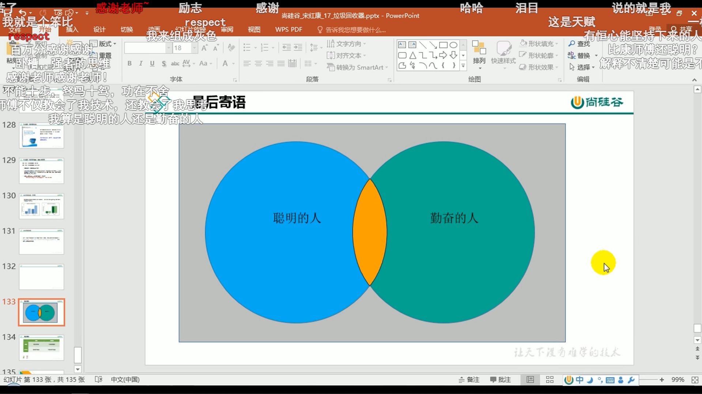

‍

**有没有可能，去超越这两类人，成为聪明且勤奋的人，** **是有可能的！** 

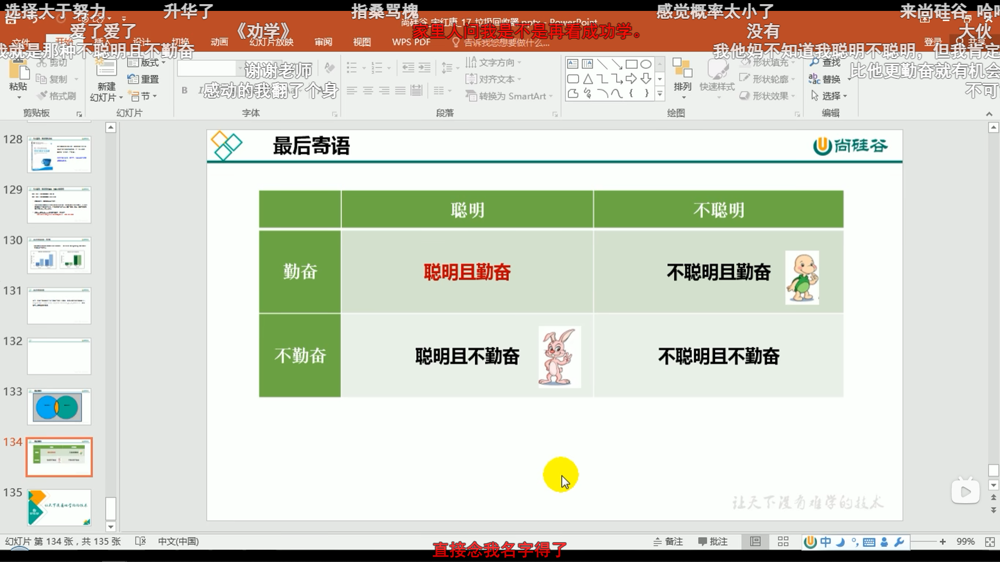

‍

‍

双亲委派机制的优劣：

优点：

1.避免类的重复加载

2.保护代码的安全，防止核心API不会被篡改

弊端：

**顶层的类加载器访问不了底层的类加载器所加载的类（例如：JDBC）** 

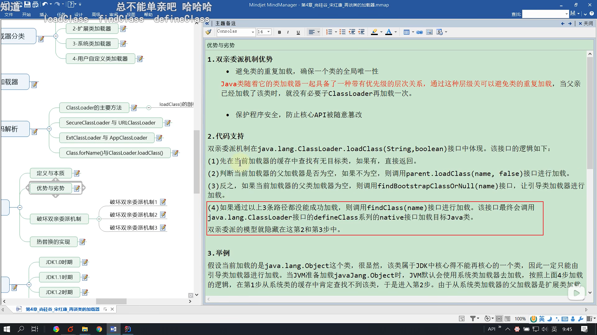

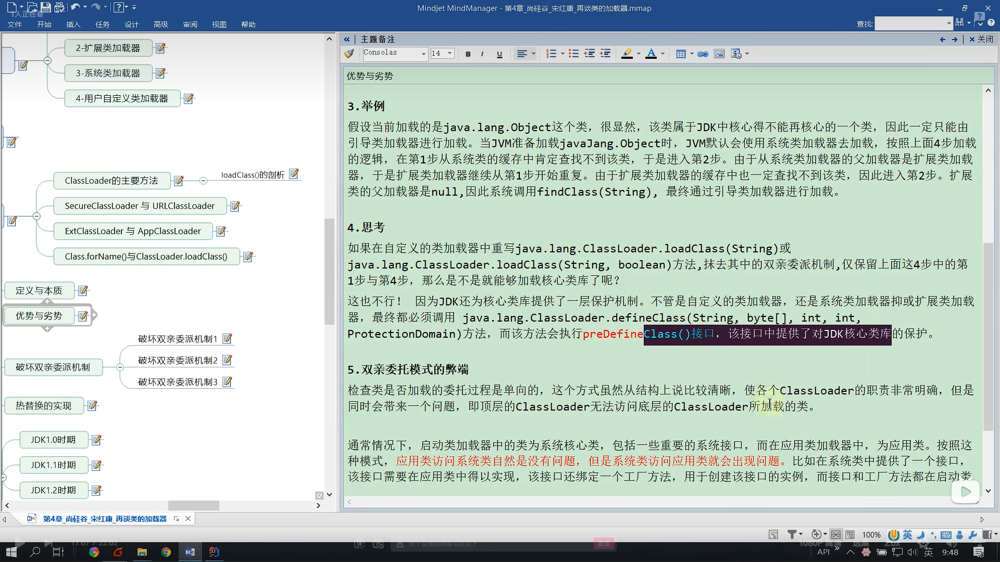

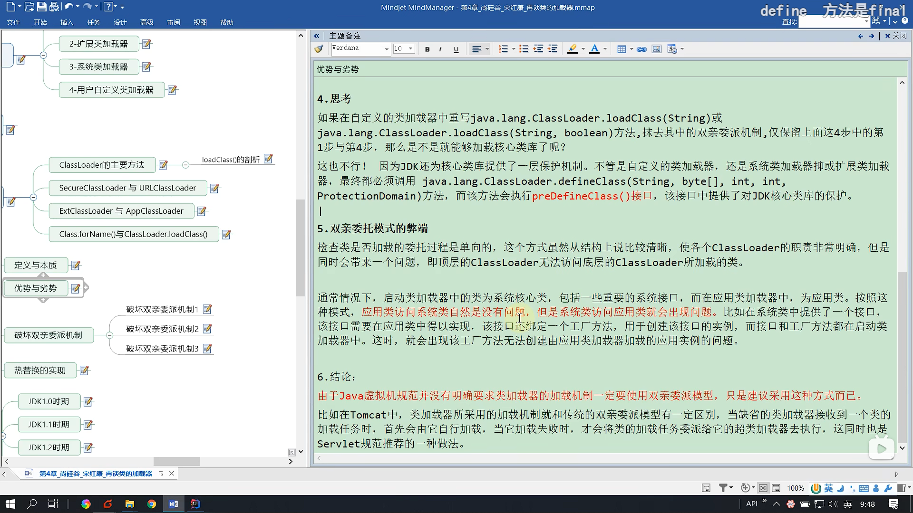

‍

‍

**如何改变双亲委派机制：重写classload中的loadclass方法，省去2，3步骤即可**

‍

‍

破坏双亲委派机制1：

**重写findclass方法**

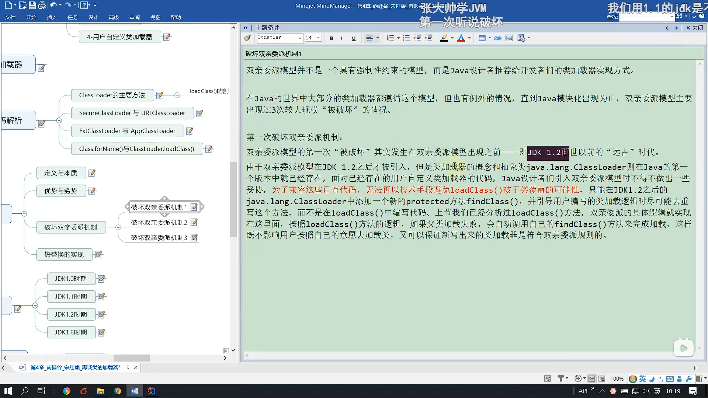

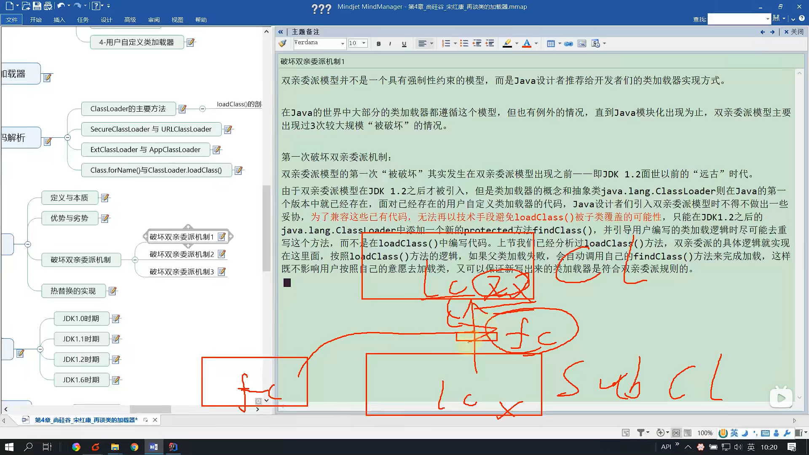

‍

‍

破坏机制2：

**线程上下文类加载器（中介）** 

**启动类加载器委托给线程上下文类加载器，由它帮助去加载我们实现的代码，实现功能的调用**

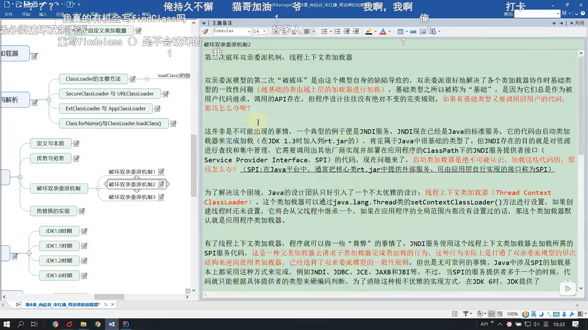

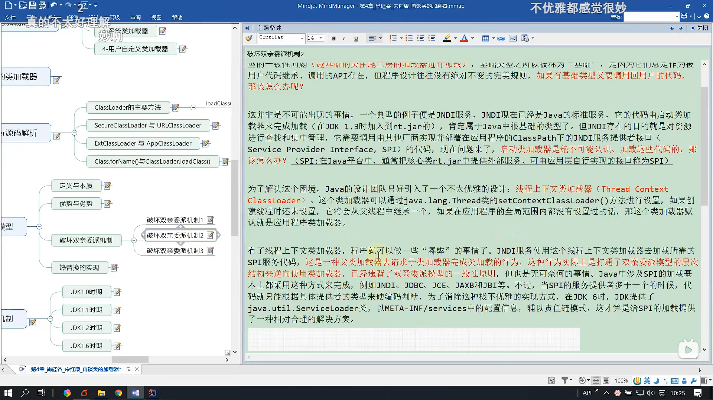

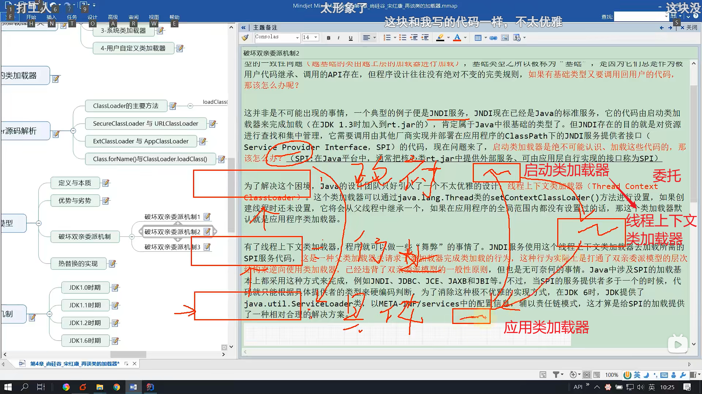

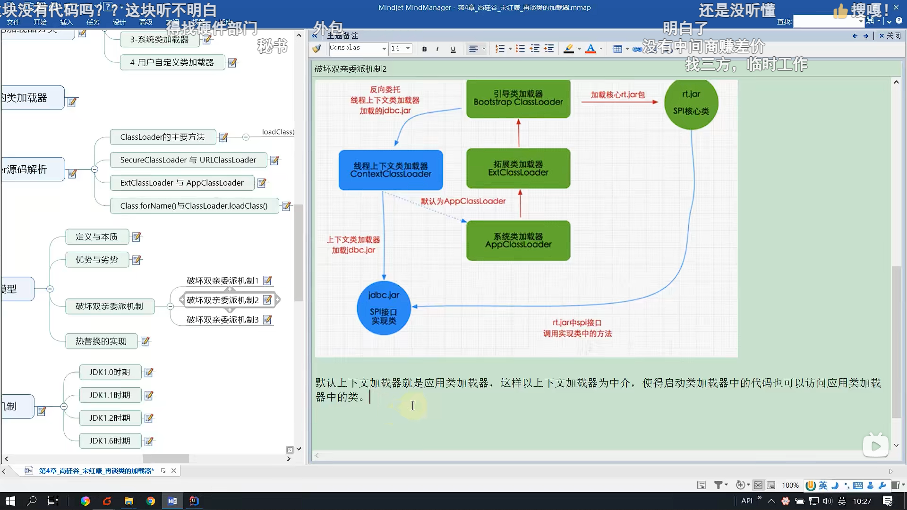

‍

‍

破坏机制3：

OSGi

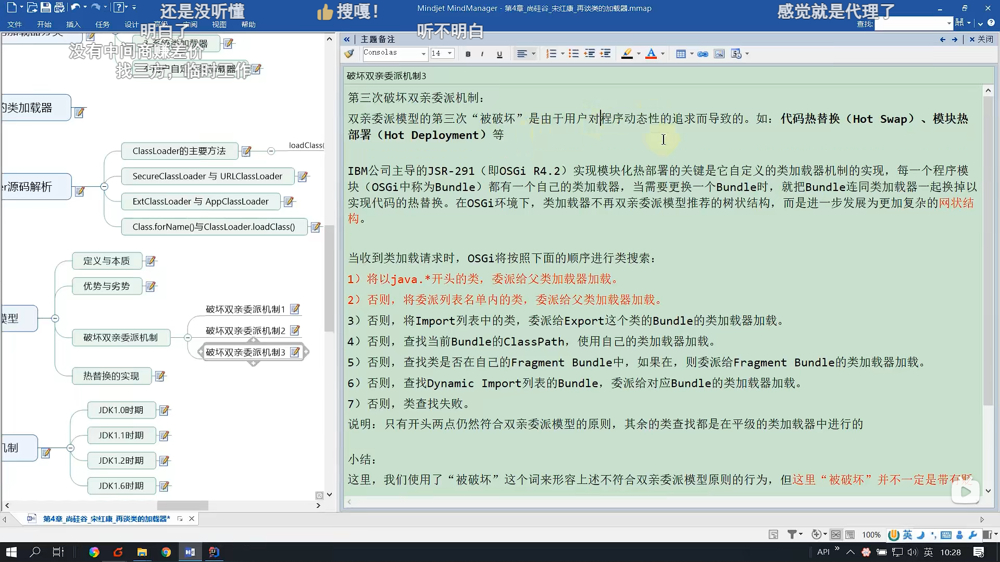

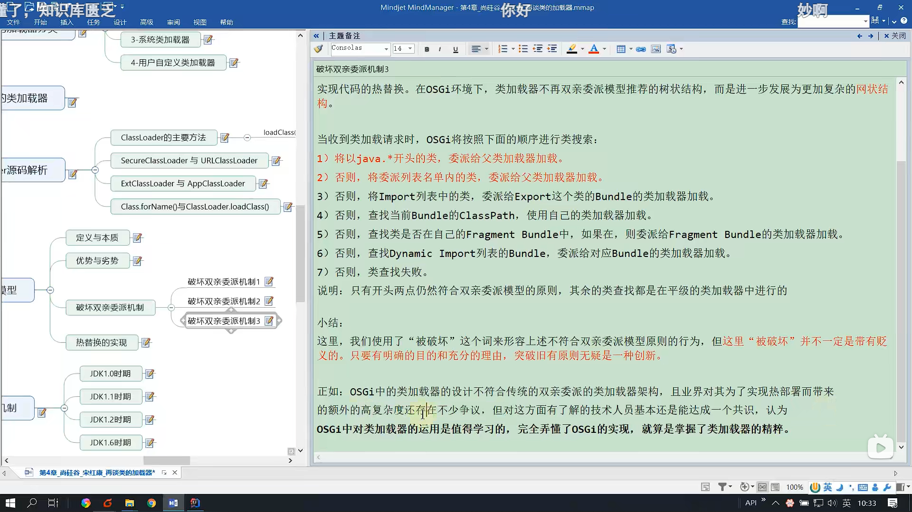

‍
